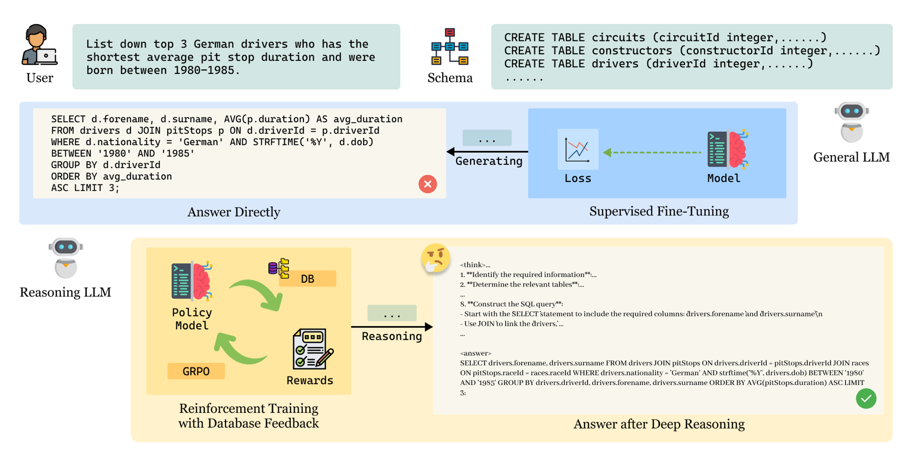

<div align="center">
<h1>SQL-R1: Training Natural Language to SQL Reasoning Model By Reinforcement Learning</h1>
</div>

<div align="center" style="display: flex; gap: 5px; justify-content: center;">
<a href="https://github.com/MPX0222/SQL-R1"></a>
<a href="https://arxiv.org/abs/2504.08600"></a>
<a href="https://github.com/MPX0222/SQL-R1"></a>
<!-- <a href="https://github.com/MPX0222/SQL-R1"></a> -->
<a href="https://github.com/MPX0222/SQL-R1/stargazers"></a>
</div>

<div style="background-color: #fff3cd; border: 1px solid #ffeeba; padding: 15px; border-radius: 5px; margin: 10px 0;">
    <p style="margin: 0; color: #856404;">
        <span style="font-weight: bold;">🚧 Note:</span> This repository is under active development. We will be continuously updating with model weights, training code, and more resources in the coming weeks. Stay tuned! ✨
    </p>
</div>

## 📖 Overview

Natural Language to SQL (NL2SQL) enables intuitive interactions with databases by transforming natural language queries into structured SQL statements.  Despite recent advancements in enhancing human-computer interaction within database applications, significant challenges persist, particularly regarding the inference performance in complex scenarios involving multi-table joins and nested queries. Current methodologies primarily utilize supervised fine-tuning (SFT) to train the NL2SQL model, which may limit adaptability and interpretability in new environments (e.g., finance and healthcare). In order to enhance the reasoning performance of the NL2SQL model in the above complex situations, we introduce SQL-R1, a novel NL2SQL reasoning model trained by the reinforcement learning (RL) algorithms. We design a specialized RL-based reward function tailored for NL2SQL tasks and discussed the impact of cold start on the effectiveness of intensive training. In addition, we achieve competitive accuracy using only a tiny amount of synthetic NL2SQL data for augmented training and further explore data engineering for RL. In existing experiments, SQL-R1 achieves execution accuracy of 88.6\% and 67.1\% on the benchmark Spider and BIRD, respectively.

<div align="center">

</div>


## 🚀 Coming Soon Checklist

- [ ] 📊 Release model weights on Hugging Face
- [ ] 🔧 Open source training code
- [ ] 📝 Detailed documentation
- [ ] 🛠️ Environment setup guide

## 📚 Citations
```
@article{ma2025sql,
  title={SQL-R1: Training Natural Language to SQL Reasoning Model By Reinforcement Learning},
  author={Ma, Peixian and Zhuang, Xialie and Xu, Chengjin and Jiang, Xuhui and Chen, Ran and Guo, Jian},
  journal={arXiv preprint arXiv:2504.08600},
  year={2025}
}
```


